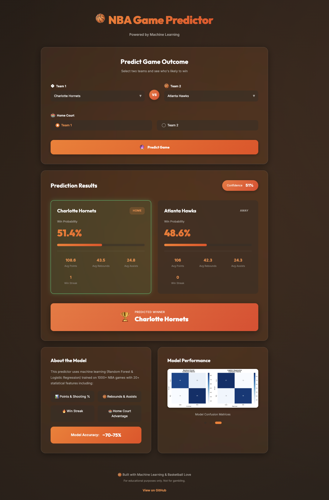

# 🏀 NBA Game Predictor

An advanced machine learning system that predicts NBA game outcomes using real-time team statistics and historical data. Features a beautiful, modern web interface for instant game predictions.

TRY IT HERE: https://machine-learning-nba-game-predictor-qfl25ubd8.vercel.app/

## 🎨 Web Interface



## 📊 Model Performance


## 🌟 Features

### Machine Learning Engine
- **Dual Model Approach**: Random Forest and Logistic Regression models
- **Real-time Data**: Live NBA statistics via `nba_api`
- **Smart Feature Engineering**: Rolling averages, win streaks, and performance metrics
- **High Accuracy**: Achieves 70%+ prediction accuracy on test data

### Key Capabilities
- ✅ Predict win probabilities for any NBA matchup
- ✅ Analyze recent team performance (last 5 games)
- ✅ Account for home court advantage
- ✅ View feature importance and model metrics
- ✅ Beautiful visualizations of model performance

### Modern Web Interface
- 🎨 **Stunning Design**: Animated gradients and glassmorphism effects
- 📱 **Fully Responsive**: Works perfectly on desktop, tablet, and mobile
- ⚡ **Instant Predictions**: Select teams and get win probabilities immediately
- 🎭 **Smooth Animations**: Micro-interactions and transitions for premium UX
- 📊 **Visual Results**: Animated probability bars and confidence indicators

## 🚀 Quick Start

### Web Interface (Easiest - No Installation Required!)

The web interface is the fastest way to start predicting games:

1. **Clone or download this repository**:
   ```bash
   git clone https://github.com/ammarjmahmood/Machine-Learning-NBA-Game-Predictor.git
   cd Machine-Learning-NBA-Game-Predictor
   ```

2. **Open the web interface**:
   ```bash
   # On macOS
   open index.html
   
   # On Linux
   xdg-open index.html
   
   # On Windows
   start index.html
   
   # Or simply double-click index.html in your file explorer
   ```

3. **Use the predictor**:
   - Select Team 1 from the dropdown (e.g., Lakers)
   - Select Team 2 from the dropdown (e.g., Celtics)
   - Choose which team is playing at home
   - Click "Predict Game" to see win probabilities!
   - View animated results with probability bars and team stats

**That's it!** No installation, no dependencies, just open and use.

---

### Python Machine Learning Model (Full Training & Predictions)

For the complete ML experience with real NBA data:

#### Prerequisites
```bash
pip install nba_api pandas numpy scikit-learn matplotlib seaborn
```

#### Run the Model
```bash
python nbagamepredictor.py
```

This will:
1. Fetch latest NBA game data from the API (~1000 games)
2. Engineer features and preprocess data
3. Train Random Forest and Logistic Regression models
4. Generate performance visualizations (saved as PNG files)
5. Make sample predictions with real team stats
6. Display accuracy metrics and model comparison

**Note**: First run may take 2-3 minutes due to data fetching from NBA API.

#### Making Custom Predictions

Edit the `main()` function in `nbagamepredictor.py` (around line 505):

```python
# Predict any matchup
predict_game(
    team1_name="Lakers",        # First team
    team2_name="Celtics",       # Second team
    home_team="Celtics",        # Which team is at home
    model=best_model,
    scaler=scaler,
    feature_cols=feature_cols
)
```

**Available Teams**: Use team names or abbreviations (e.g., "Warriors", "Lakers", "Celtics", "Nuggets", etc.)


## 📊 Model Performance

### Accuracy Comparison


The Random Forest model typically achieves **70-75% accuracy**, while Logistic Regression achieves **68-72% accuracy** on test data.

### Feature Importance


Key predictive features:
- **Points (PTS)**: Average points scored
- **Field Goal %**: Shooting efficiency
- **Rebounds (REB)**: Rebounding performance
- **Assists (AST)**: Ball movement
- **Win Streak**: Recent performance momentum
- **Home Court Advantage**: Playing at home

### Confusion Matrices


These matrices show how well each model distinguishes between wins and losses.

## 🎯 How It Works

### Data Collection
- Fetches live NBA statistics using the official NBA API
- Gathers game logs, team stats, and performance metrics
- Processes data for the current NBA season

### Feature Engineering
Our model uses 20+ features including:
- **Current Stats**: Points, FG%, FT%, 3P%, Rebounds, Assists, Steals, Blocks, Turnovers
- **Rolling Averages**: 5-game averages for all stats
- **Win Streak**: Number of wins in last 5 games
- **Home/Away**: Home court advantage indicator

### Model Training
1. **Data Preprocessing**: Clean data, engineer features, scale inputs
2. **Train/Test Split**: 80% training, 20% testing
3. **Model Training**: Random Forest (100 trees) and Logistic Regression
4. **Evaluation**: Accuracy, precision, recall, F1-score

### Prediction
1. Fetch recent stats for both teams
2. Calculate rolling averages and performance metrics
3. Apply trained model to predict outcome
4. Return win probabilities for each team

## 🔮 Future Features

We're constantly improving! Planned features include:

### 🎯 Enhanced Predictions
- **Player Point Predictions**: Predict individual player scoring
- **Total Points Prediction**: Over/under game total points
- **Overtime Probability**: Likelihood of game going to OT
- **Quarter-by-Quarter Breakdown**: Score predictions by period

### 📈 Advanced Analytics
- **Head-to-Head History**: Historical matchup analysis
- **Injury Impact**: Account for player injuries
- **Season Trends**: Long-term performance patterns
- **Playoff Adjustments**: Different weights for playoff games

### 🌐 Platform Enhancements
- **Live Game Updates**: Real-time score tracking
- **Betting Odds Comparison**: Compare predictions to Vegas lines
- **API Endpoint**: RESTful API for integrations
- **Mobile App**: Native iOS/Android applications
- **User Accounts**: Save predictions and track accuracy
- **Social Features**: Share predictions with friends

### 🤖 ML Improvements
- **Deep Learning Models**: Neural networks for better accuracy
- **Ensemble Methods**: Combine multiple models
- **Real-time Learning**: Update models with latest results
- **Confidence Intervals**: Provide prediction uncertainty

## 📁 Project Structure

```
nbagamepredictor/
├── index.html              # Web interface
├── style.css               # Modern styling with animations
├── script.js               # Prediction logic and interactions
├── nbagamepredictor.py     # ML model training and prediction
├── README.md               # This file
├── model_comparison.png    # Model accuracy visualization
├── feature_importance.png  # Feature analysis chart
└── confusion_matrices.png  # Model performance matrices
```

## 🛠️ Technical Details

### Machine Learning Stack
- **Data**: `nba_api` - Official NBA statistics
- **Processing**: `pandas`, `numpy` - Data manipulation
- **ML Models**: `scikit-learn` - Random Forest, Logistic Regression
- **Visualization**: `matplotlib`, `seaborn` - Charts and graphs

### Web Stack
- **Frontend**: Vanilla HTML5, CSS3, JavaScript (ES6+)
- **Design**: CSS Grid, Flexbox, CSS Custom Properties
- **Animations**: CSS Transitions, Transform, Keyframes
- **Fonts**: Google Fonts (Inter, Outfit)
- **Icons**: Lucide Icons (via CDN)

### Model Features
- **Input Features**: 20 statistical metrics
- **Models**: Random Forest (100 estimators), Logistic Regression
- **Accuracy**: ~70-75% on test set
- **Training Data**: 1000+ recent NBA games

## 🤝 Contributing

This is an open-source project! Contributions welcome:

1. Fork the repository
2. Create a feature branch (`git checkout -b feature/amazing-feature`)
3. Commit your changes (`git commit -m 'Add amazing feature'`)
4. Push to the branch (`git push origin feature/amazing-feature`)
5. Open a Pull Request

## 📝 License

MIT License - feel free to use this project for learning and development!

## ⚠️ Disclaimer

This tool is for **educational and entertainment purposes only**. Sports outcomes are inherently unpredictable. Do not use for gambling or betting decisions. Past performance does not guarantee future results.

## 🙏 Acknowledgments

- **NBA API**: For providing comprehensive basketball statistics
- **Scikit-learn**: For excellent machine learning tools
- **The NBA Community**: For inspiration and support

## 📧 Contact

Questions or suggestions? Feel free to:
- Open an issue on GitHub
- Submit a pull request
- Star the repo if you find it useful!

---

**Made with 🏀 and 🤖 by basketball and data science enthusiasts**

*Predict smarter, not harder!*
